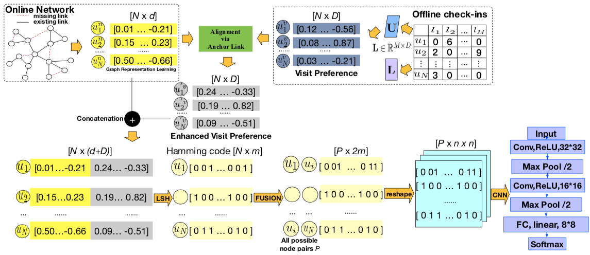

# vec2Link: Unifying Online and Offline Preference for Social Link Prediction

This repository provides a Python implementation of *vec2Link*

Recent advances in network representation learning have enabled significant improvements in the link prediction task, which is at the core of many downstream applications. As an increasing amount of mobility data becomes available due to the development of location-based technologies, we argue that this resourceful mobility data can be used to improve link prediction performance. In this paper, we propose a novel link prediction framework that utilizes user offline check-in behavior combined with user online social relations. We model user offline location preference via a probabilistic factor model and represent user social relations using neural network representation learning. To capture the correlation of these two sources, we develop an anchor link method to align these two different user latent representations. Furthermore, we employ locality-sensitive hashing to project the aggregated user representation into a binary matrix, which not only preserves the data structure but also improves the efficiency of convolutional network learning. By comparing with several baseline methods that solely rely on social networks or mobility data, we show that our unified approach significantly improves the link prediction performance.

The *vec2Link* is a novel link prediction framework, by jointly modeling both user's social network relationship and spatio-temporal check-in mobility

Before executing *vec2Link*, it is necessary to install the following packages:
 
``pip install futures``
 
``pip install fastdtw``
 
``pip install gensim``

## Requirements

-  numpy==1.13.1
-  networkx==2.0
-  scipy==0.19.1
-  tensorflow==1.3.0
-  gensim==3.0.1
-  scikit-learn==0.19.0

### Dataset
- --You can access all datasets from [datasets/](https://github.com/kpzhang/vec2link/tree/master/datasets) or download from their original sources: 
- --You can download [Gowalla data set [DC & CHI]](http://snap.stanford.edu/data/loc-gowalla.html) here.
- --You can download [Brightkite](http://snap.stanford.edu/data/loc-Brightkite.html) here.
- --You can download [Foursquare [NYC & TKY]](https://sites.google.com/site/yangdingqi/home/foursquare-dataset) here.

### Basic Usage

- --run codes under /data_process/ by the following order:data_proper_time.py, data_filter.py, and data_split.py
- --run codes under /NE/[Open NE](https://github.com/thunlp/OpenNE) or /struc2vec/ [struc2vec](https://github.com/leoribeiro/struc2vec) to obtain the network representation.
- --run codes under /poissionmf/ by the following order:data_checkins.py and create_matrix to obtain the spatiotemporal check-in representation
- --run /evaluate/ to estimate the performance of vec2link. The four_methods.py and model_mlp.py will generate four contrastive experiments. The lsh_joint.py and model_scalp.py are used to evaluate the *vec2link*

#### Options

- --You can choose the location range of check_ins or the check-in time by modifying /data_process/data_proper_time.py
- --You can choose *n* user records, *m* POI IDs, and the number of user nodes(the sub-graph) by modifying /data_process/data_filter.py
- --You can adjust the proportion of the training set and the test set by modifying /data_process/data_split.py
- --You can choose the method of network embedding in /NE/ which includes:node2vec, line, deepWalk, grarep or /struc2vec/ which includes:struc2vec to generate the network representations

### Miscellaneous

*Note:* This is only a reference implementation of *vec2link*. For details or questions, please contact the author.
